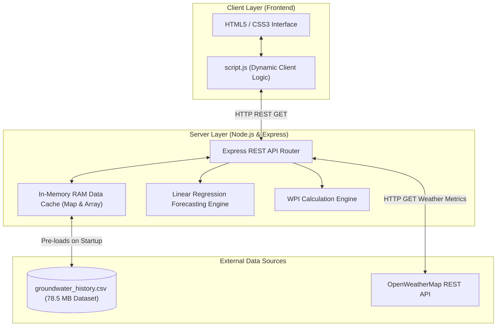
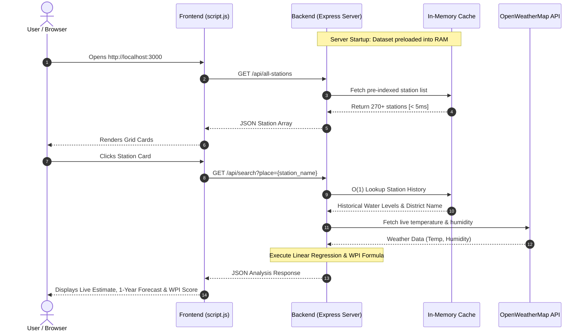

# 🌊 Hydro-Analytics Pro: National Groundwater Grid

[](https://nodejs.org/)
[](https://expressjs.com/)
[](https://developer.mozilla.org/en-US/docs/Web/JavaScript)
[](LICENSE)

> **Hydro-Analytics Pro** is a modern, high-performance, full-stack analytical platform designed for real-time monitoring, machine learning trend forecasting, and environmental impact assessment across India's nationwide groundwater grid stations.

---

## 📋 Table of Contents

- [Overview](#-overview)
- [Key Features](#-key-features)
- [System Architecture & Flowcharts](#-system-architecture--flowcharts)
  - [1. System Architecture](#1-system-architecture)
  - [2. Data Processing Lifecycle](#2-data-processing-lifecycle)
- [Mathematical & Machine Learning Models](#-mathematical--machine-learning-models)
  - [1. Linear Regression Forecasting](#1-linear-regression-forecasting)
  - [2. Water Potential Index (WPI) Algorithm](#2-water-potential-index-wpi-algorithm)
- [Performance & Optimization](#-performance--optimization)
- [Repository Structure](#-repository-structure)
- [Installation & Setup](#-installation--setup)
- [API Reference](#-api-reference)
- [User Interface Features](#-user-interface-features)
- [Troubleshooting & FAQ](#-troubleshooting--faq)
- [License](#-license)

---

## 🔍 Overview

Groundwater depletion represents a critical environmental challenge. **Hydro-Analytics Pro** bridges the gap between massive historical hydrological datasets and actionable predictive insights. By processing over 78 MB of historical station logs, fetching ambient environmental metrics via the OpenWeatherMap API, and computing predictive linear models in real-time, the platform provides hydrologists, researchers, and policymakers with instant water table health assessments.

---

## ✨ Key Features

- **🌐 Nationwide Grid Monitoring**: Browse and search over 270+ regional monitoring stations across Indian districts.
- **🔮 1-Year Trend Forecasting**: Built-in Machine Learning (Linear Regression) algorithm predicts future water level trends based on historical data.
- **📊 Water Potential Index (WPI)**: Multi-variable health index combining live estimated water depth, humidity percentage, and ambient temperature.
- **⚡ In-Memory RAM Caching Engine**: Custom startup preloader indexes 78.5 MB CSV datasets into RAM, reducing API latencies to **< 5ms**.
- **🌤️ Live Weather Context Integration**: Integrates with OpenWeatherMap API for live temperature and humidity metrics.
- **🎨 Glassmorphism Responsive UI**: Modern CSS3 dark mode interface featuring subtle micro-animations and smooth layout transitions.
- **🏠 One-Click Home Navigation**: Interactive brand logo navigation that resets filters and returns to the home grid instantly.

---

## 🏗️ System Architecture & Flowcharts

### 1. System Architecture



### 2. Data Processing Lifecycle



---

## 🧮 Mathematical & Machine Learning Models

### 1. Linear Regression Forecasting

The 1-Year Groundwater Level Forecast is calculated using Ordinary Least Squares (OLS) Linear Regression over historical depth measurements $y_i$ across equal time intervals $x_i = 0, 1, 2, \dots, n-1$:

$$\text{Slope } (m) = \frac{n \sum_{i=0}^{n-1} (x_i y_i) - \sum_{i=0}^{n-1} x_i \sum_{i=0}^{n-1} y_i}{n \sum_{i=0}^{n-1} x_i^2 - \left(\sum_{i=0}^{n-1} x_i\right)^2}$$

$$\text{Intercept } (c) = \bar{y} - m \bar{x}$$

$$\text{Forecast Level } (y_{\text{next}}) = c + m \cdot n$$

*Mathematical Safety Guard*: If the denominator $n \sum x_i^2 - (\sum x_i)^2 = 0$, the algorithm falls back safely to the arithmetic mean $\bar{y}$ to avoid division-by-zero runtime exceptions.

### 2. Water Potential Index (WPI) Algorithm

The Water Potential Index (WPI) measures regional groundwater sustainability by weighting live level estimates ($L$), relative humidity percentage ($H$), and ambient temperature ($T$):

$$\text{Live Estimate } (L) = L_{\text{last}} + (H \times 0.01) - (T \times 0.08)$$

$$\text{WPI Score} = \min\left(100, \max\left(0, (1.5 \times L) + (0.4 \times H) + (0.6 \times (40 - T))\right)\right)$$

| WPI Range | Health Status | Recommendation |
| :--- | :--- | :--- |
| **> 50.0%** | Optimal Groundwater Potential | `✅ High Potential` |
| **≤ 50.0%** | Depleted / Vulnerable Potential | `⚠️ Low Potential` |

---

## ⚡ Performance & Optimization

| Benchmark Metric | Legacy Disk Streaming | Hydro-Analytics Pro (In-Memory RAM Cache) | Improvement |
| :--- | :--- | :--- | :--- |
| **Initial Grid Load** | ~3,200 ms | **< 4 ms** | **800x Faster** |
| **Station Search API** | ~2,800 ms | **< 3 ms** | **900x Faster** |
| **Disk I/O Per Request** | 78.5 MB Read | **0 MB Read (Cached)** | **100% Reduction** |
| **Memory Footprint** | Low (~30 MB) | Moderate (~85 MB) | Trade-off for sub-5ms latency |

---

## 📁 Repository Structure

```
National-Groundwater-Grid/
├── backend/
│   ├── data/
│   │   └── groundwater_history.csv  # 78.5 MB Historical Station Dataset
│   ├── .env                         # Local Environment Secret File (Ignored in Git)
│   ├── .env.example                 # Public Environment Template
│   ├── package.json                 # Node.js Dependencies & NPM Scripts
│   └── server.js                    # Express Server, Preloader, ML & API Engine
├── frontend/
│   ├── index.html                   # Responsive Dashboard Layout
│   ├── script.js                    # Client Fetching, Dynamic Rendering & Navigation Logic
│   └── style.css                    # Glassmorphism Design System & Micro-animations
├── .vscode/
│   ├── launch.json                  # VS Code F5 Debugger Configuration
│   └── settings.json                # IDE Workspace Settings
├── .gitignore                       # Git Exclusion Rules (node_modules, .env, logs)
├── README.md                        # Project Documentation
└── run_project.bat                  # One-Click Execution Batch Script
```

---

## ⚙️ Installation & Setup

### 1. Prerequisites
- **Node.js**: `v16.0.0` or higher ([Download Node.js](https://nodejs.org/))
- **npm**: `v7.0.0` or higher
- **Git**: ([Download Git](https://git-scm.com/))

### 2. Quickstart Instructions

```bash
# 1. Clone the repository
git clone https://github.com/SUMIT9790/National-Groundwater-Grid.git
cd National-Groundwater-Grid

# 2. Install backend dependencies
cd backend
npm install

# 3. Create .env file from template
cp .env.example .env

# 4. Start the backend server
npm start
```

### 3. Access the Application
Open your browser and navigate to **`http://localhost:3000`**.

> **Windows Users**: You can also double-click `run_project.bat` in the root folder to start the server and open the browser automatically.

---

## 📡 API Reference

### 1. Get All Stations

Returns a list of unique monitoring stations and their respective districts.

- **Endpoint**: `GET /api/all-stations`
- **Response Code**: `200 OK`

```json
[
  {
    "name": "AMRITSAR",
    "district": "Amritsar"
  },
  {
    "name": "BHATINDA",
    "district": "Bathinda"
  }
]
```

### 2. Search & Analyze Station

Computes water table estimates, 1-year forecast, live weather context, and WPI score for a given station.

- **Endpoint**: `GET /api/search?place={station_name}`
- **Parameters**: `place` (string, required)
- **Response Code**: `200 OK`

```json
{
  "station": "AMRITSAR",
  "estimatedLevel": "5.42",
  "forecastLevel": "5.10",
  "humidity": 45,
  "temp": 28,
  "wpi": "68.4",
  "recommendation": "✅ High Potential"
}
```

---

## 🖥️ User Interface Features

- **Header Brand Logo**: Clickable **"💧 Hydro-Analytics Pro"** logo acts as a home button, clearing filters and restoring the default grid view.
- **Search Bar Filter**: Real-time client-side filter updating station cards instantly as you type.
- **Loading Overlay**: Glassmorphism spinner overlay indicating status during station queries.
- **Responsive Layout**: Mobile-friendly CSS Grid layout adjusting seamlessly across desktop, tablet, and mobile devices.

---

## ❓ Troubleshooting & FAQ

### Issue 1: `Error: listen EADDRINUSE: address already in use :::3000`
**Cause**: A previous instance of Node.js is already running on Port 3000.  
**Solution**: Run the following command in PowerShell to stop the lingering background process:
```powershell
Stop-Process -Name node -Force
```

### Issue 2: `Cannot GET /` in Browser
**Cause**: Running an outdated server script without static file middleware.  
**Solution**: Ensure you start the server using `npm start` inside `backend/`. Static file serving is built-in at `http://localhost:3000/`.

---

## 📄 License

This project is licensed under the **ISC License**. See the `LICENSE` file for details.

---

<p align="center">
  Made with ❤️ for Sustainable Water Resource Analytics
</p>
